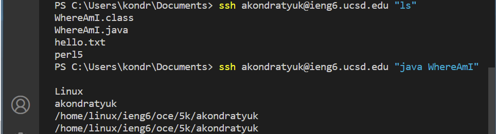

# **Week 1 Lab Report**

## 1. Install Visual Studio Code

Install Visual Studio Code for your operating system.

[Visual Studio Code](https://code.visualstudio.com/download)


## 2. Connect to cs15lfa22 Account Using SSH

* If you are running Windows OS, Install OpenSSH on your computer: [OpenSSH](https://docs.microsoft.com/en-us/windows-server/administration/openssh/openssh_install_firstuse)

* Look up your course-specific account for CSE15L here: [https://sdacs.ucsd.edu/~icc/index.php](https://sdacs.ucsd.edu/~icc/index.php)

* Open terminal in VS Code (ctrl or command + ` ).<br>Enter this command and do not forget to enter your unique letters instead of **zz**.
```
ssh cs15lfa22zz@ieng6.ucsd.edu
```


***NOTE: It is possible that your CSE 15L specific account might not be yet available for use, try using your TritonLink username.***

## 3. Try Some Commands on The Remote Machine

Sample commands to try:

```
cd
cd ~
ls -a
ls /home/linux/ieng6/cs15lfa22/cs15lfa22abc
cat /home/linux/ieng6/cs15lfa22/public/hello.txt
```


## 4. Moving Files over SSH with SCP

* We will be moving and using WhereAmI.java file to demonstrate the SCP and different directories on different machines.
* Create WhereAmI.java file on your machine.
```
class WhereAmI {
  public static void main(String[] args) {
    System.out.println(System.getProperty("os.name"));
    System.out.println(System.getProperty("user.name"));
    System.out.println(System.getProperty("user.home"));
    System.out.println(System.getProperty("user.dir"));
  }
}
```
* Run it
```
javac WhereAmI.java
java WhereAmI
```
* Move this file to the remote machine with SCP (do not forget to enter your unique letters instead of **zz**):
```
scp WhereAmI.java cs15lfa22zz@ieng6.ucsd.edu:~/
```

* Log into the remote machine to try running WhereAmI.java:


## 5. Connecting to The Remote Machine Using SSH Keys without Presenting a Password

* Generate Key Pair:
```
ssh-keygen
```
**Note**: When given the prompt to Enter file in which to save the key:<br>Press enter again to specify the default path and take note of it.

* Now, make `.ssh` directory on your remote machine by running:
```
mkdir .ssh
```

* Then SCP the public key to the remote machine.<br>**Do not forget to enter your local username instead of kondr.**
```
scp /Users/kondr/.ssh/id_rsa.pub cs15lfa22@ieng6.ucsd.edu:~/.ssh/authorized_keys
```


## 6. Optimizing Remote Running

* It is possible to write a command in quotes at the end of an ssh command to directly run it on the remote server, then exit.<br>Try running some commands, for example `ls` or `java WhereAmI`:
```
ssh cs15lfa22zz@ieng6.ucsd.edu "java WhereAmI"
```


[Back](index.html)