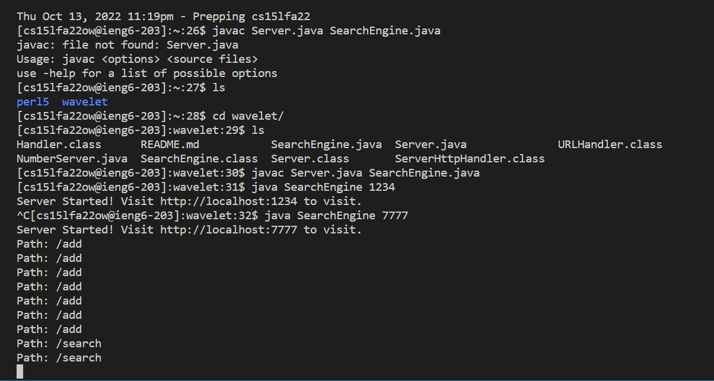
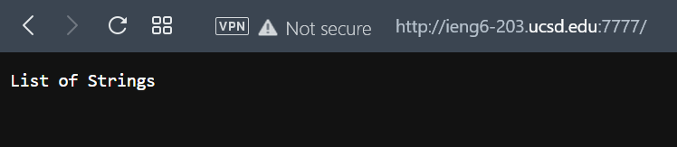
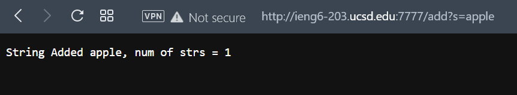
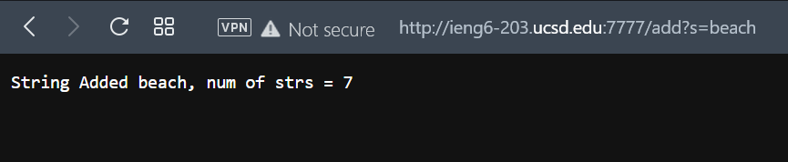
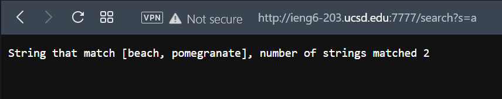
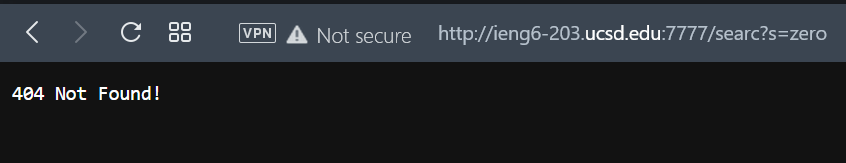
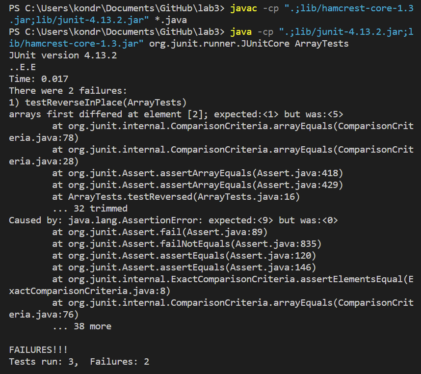
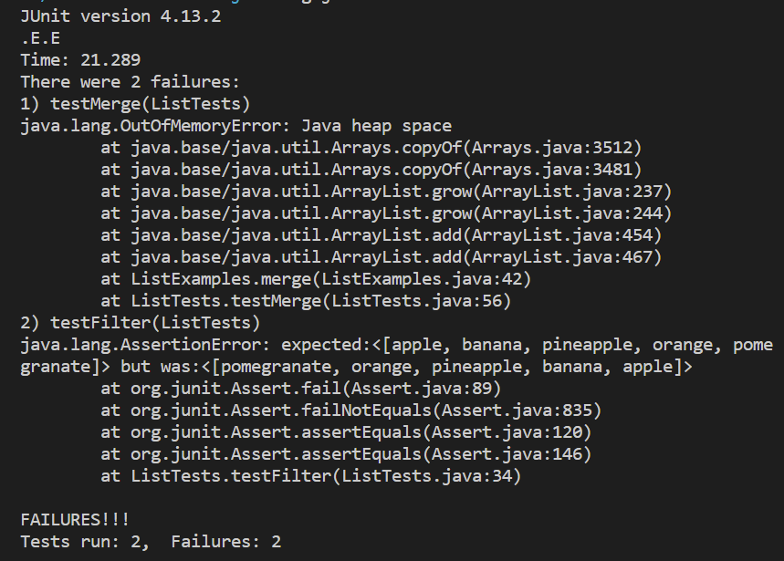

# **Week 3 Lab Report**

## **Part 1**

I wrote simple SearchEngine class by refering to NumberServer implementation. SearchEngine has class Handler that implements interface URLHandler. Method `handleRequest` which handles `/add` and `/search` queries. Interaction with SearchEngine functions has following arguments:

```
/add?s=String
```

```
/search?s=String
```

Function `/add` adds String to the arrays of string, and `/search` searches Strings containing query.

Following is SearchEngine.java:

```
import java.io.IOException;
import java.net.URI;
import java.util.ArrayList;

class Handler implements URLHandler {
    // The one bit of state on the server: a number that will be manipulated by
    // various requests.
    ArrayList<String> strs = new ArrayList<>();

    public String handleRequest(URI url) {
        if (url.getPath().equals("/")) {
            return String.format("List of Strings", strs);

        } else if (url.getPath().contains("/add")){
            System.out.println("Path: " + url.getPath());
            if (url.getPath().contains("/add")) {
                String[] parameters = url.getQuery().split("=");
                if (parameters[0].equals("s")) {
                    strs.add(parameters[1]);
                    return String.format("String Added %s, num of strs = %d", parameters[1], strs.size());
                }
            }
            return "404 Not Found!";

        } else if (url.getPath().contains("/search")){
            System.out.println("Path: " + url.getPath());
            if (url.getPath().contains("/search")) {
                String[] parameters = url.getQuery().split("=");
                if (parameters[0].equals("s")) {
                    ArrayList<String> matches = new ArrayList<>();
                    for(int i=0; i<strs.size(); i++){
                        if(strs.get(i).contains(parameters[1])){
                            matches.add(strs.get(i));
                        }
                    }
                    return String.format("String that match %s, number of strings matched %d", matches, matches.size());
                }
            }
            return "404 Not Found!";
        }else{
            return "404 Not Found!";
        }
    }
}


public class SearchEngine {
    public static void main(String[] args) throws IOException {
        if(args.length == 0){
            System.out.println("Missing port number! Try any number between 1024 to 49151");
            return;
        }

        int port = Integer.parseInt(args[0]);

        Server.start(port, new Handler());
    }
}
```

I decided to push it to my github repository, and then try it on the remote machine.





Then I populated the array with several strings.





And finally, I tried the `/search` function.






## **Part 2**
## Bug in method `reverseInPlace(int[] arr)` from `ArrayExamples.java`

Code of the test `testReverseInPlace()`:
```
@Test 
public void testReverseInPlace() {
    int[] input1 = {1,3,5};
    ArrayExamples.reverseInPlace(input1);
    assertArrayEquals(new int[]{5,3,1}, input1);
}
```



Code with bugs:
```
static void reverseInPlace(int[] arr) {
    for(int i = 0; i < arr.length; i += 1) {
      arr[i] = arr[arr.length - i - 1];
    }
  }
```

I fixed it using `temp` variable to switch the order of array, and I divided the number of loops by 2, `i < arr.length/2`.

Fixed code:
```
static void reverseInPlace(int[] arr) {
    for(int i = 0; i < arr.length/2; i += 1) {
      int temp = arr[arr.length - i - 1];
      arr[arr.length - i - 1] = arr[i];
      arr[i] = temp;
    }
  }
```

The bug was actually an error, without using the `temp` variable and diving loop length by 2 the method removes values of half of the array.

## Bug in method `merge(List<String> list1, List<String> list2)` from `ListExamples.java`

Code of the test `testMerge()`:
```
@Test
public void testMerge(){
    List<String> input1 = new ArrayList<>();
    List<String> input2 = new ArrayList<>();
    List<String> both = new ArrayList<>();

    input1.add("apple");
    input1.add("banana");
    input1.add("pineapple");

    input2.add("orange");
    input2.add("pomegranate");

    both.addAll(input1);
    both.addAll(input2);
    both.sort(null);

    assertEquals(both, ListExamples.merge(input1, input2));
}
```



Code with bugs:
```
static List<String> merge(List<String> list1, List<String> list2) {
    List<String> result = new ArrayList<>();
    int index1 = 0, index2 = 0;
    while(index1 < list1.size() && index2 < list2.size()) {
      if(list1.get(index1).compareTo(list2.get(index2)) < 0) {
        result.add(list1.get(index1));
        index1 += 1;
      }
      else {
        result.add(list2.get(index2));
        index2 += 1;
      }
    }
    while(index1 < list1.size()) {
      result.add(list1.get(index1));
      index1 += 1;
    }
    while(index2 < list2.size()) {
      result.add(list2.get(index2));
      index1 += 1;
    }
    return result;
  }
```

The bug is in the third `while` loop in `index1 +- 1;` line:
```
while(index2 < list2.size()) {
      result.add(list2.get(index2));
      index1 += 1;
}
```

Fixed code:
```
static List<String> merge(List<String> list1, List<String> list2) {
    List<String> result = new ArrayList<>();
    int index1 = 0, index2 = 0;
    while(index1 < list1.size() && index2 < list2.size()) {
      if(list1.get(index1).compareTo(list2.get(index2)) < 0) {
        result.add(list1.get(index1));
        index1 += 1;
      }
      else {
        result.add(list2.get(index2));
        index2 += 1;
      }
    }
    while(index1 < list1.size()) {
      result.add(list1.get(index1));
      index1 += 1;
    }
    while(index2 < list2.size()) {
      result.add(list2.get(index2));
      index2 += 1;
    }
    return result;
  }
```

The bug caused `OutOfMemoryError`, third `while` loop was adding strings to `result` array infinitely.

[Back](index.html)