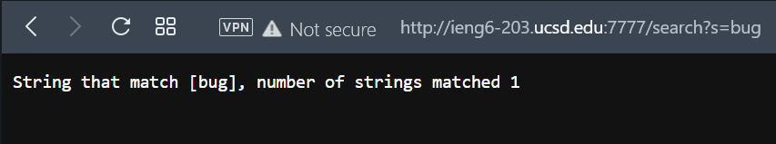

# **Week 3 Lab Report**

## **Part 1**

I wrote simple SearchEngine class by refering to NumberServer implementation. SearchEngine has class Handler that implements interface URLHandler. Method `handleRequest` which handles `/add` and `/search` queries. Interaction with SearchEngine functions has following arguments:

```
/add?s=String
```

```
/search?s=String
```

Function `/add` adds String to the arrays of string, and `/search` searches Strings containing query.

Following is SearchEngine.java:

```
import java.io.IOException;
import java.net.URI;
import java.util.ArrayList;

class Handler implements URLHandler {
    // The one bit of state on the server: a number that will be manipulated by
    // various requests.
    ArrayList<String> strs = new ArrayList<>();

    public String handleRequest(URI url) {
        if (url.getPath().equals("/")) {
            return String.format("List of Strings", strs);

        } else if (url.getPath().contains("/add")){
            System.out.println("Path: " + url.getPath());
            if (url.getPath().contains("/add")) {
                String[] parameters = url.getQuery().split("=");
                if (parameters[0].equals("s")) {
                    strs.add(parameters[1]);
                    return String.format("String Added %s, num of strs = %d", parameters[1], strs.size());
                }
            }
            return "404 Not Found!";

        } else if (url.getPath().contains("/search")){
            System.out.println("Path: " + url.getPath());
            if (url.getPath().contains("/search")) {
                String[] parameters = url.getQuery().split("=");
                if (parameters[0].equals("s")) {
                    ArrayList<String> matches = new ArrayList<>();
                    for(int i=0; i<strs.size(); i++){
                        if(strs.get(i).contains(parameters[1])){
                            matches.add(strs.get(i));
                        }
                    }
                    return String.format("String that match %s, number of strings matched %d", matches, matches.size());
                }
            }
            return "404 Not Found!";
        }else{
            return "404 Not Found!";
        }
    }
}


public class SearchEngine {
    public static void main(String[] args) throws IOException {
        if(args.length == 0){
            System.out.println("Missing port number! Try any number between 1024 to 49151");
            return;
        }

        int port = Integer.parseInt(args[0]);

        Server.start(port, new Handler());
    }
}
```

I decided to push it to my github repository, and then try it on the remote machine.


Then I populated the array with several strings.


And finally, I tried the `/search` function.




## **Part 2**


[Back](index.html)