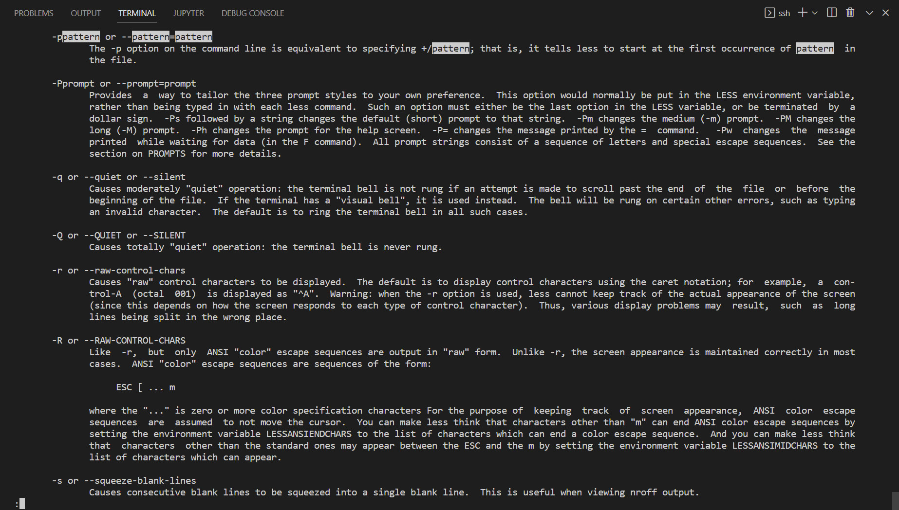
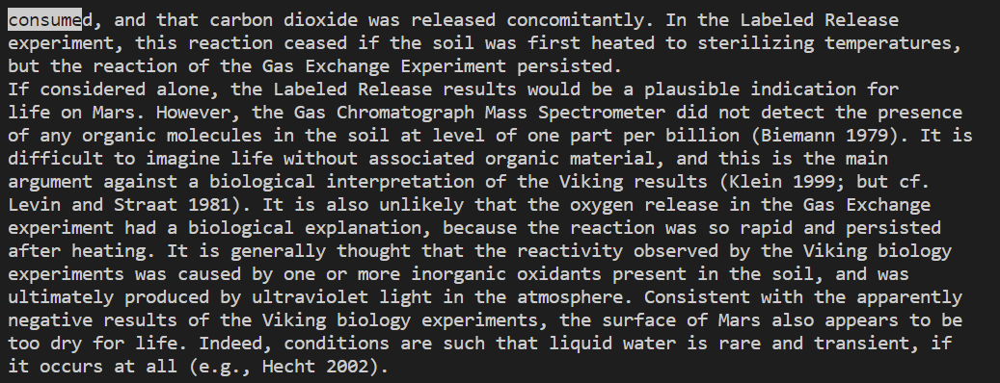

# Lab Report Week 5: Researching Commands

## `less` command

1) For example, `less -p` can be used to find an option for a command in man:

```
-ppattern or --pattern=pattern
    The -p option on the command line is equivalent to specifying +/pattern; that is, it tells less to start at the first occurrence of pattern in the file.
```



2) Another useful example is `less -I` which will ingnore the case of the searched pattern.

```
-I or --IGNORE-CASE
    Like -i, but searches ignore case even if the pattern contains uppercase letters.
```

```
less -I -pCONSUME journal.pbio.0020302.txt
```



3) One more useful exapmple is `less -E`. It will exit the file at its end and jump to a next file. With this option we can search for a pattern in several files at once.

```
-E or --QUIT-AT-EOF
    Causes less to automatically exit the first time it reaches end-of-file.
```

```
less -I -N -pCONSUME -E ./*.txt
```

Option `-N` will display the line numbers.

## `find` command

1) `find -empty` will find empty files and folders in a directory.

The directory `/technical` contains no empty files.

```
[cs15lfa22ow@ieng6-201]:technical:253$ find ./ -empty
[cs15lfa22ow@ieng6-201]:technical:254$ 
```

2) Usefull usage is `find / -amin -60`, this command will show all files which were accessed in last 60 min.

```
[cs15lfa22ow@ieng6-201]:technical:245$ find ./ -amin -60
./
./911report
./biomed
./government
./government/About_LSC
./government/Alcohol_Problems
./government/Env_Prot_Agen
./government/Gen_Account_Office
./government/Media
./government/Post_Rate_Comm
./plos
```

3) Another useful option for the `find` command is `find -size +200k`. This option will find all files in a directory that are larger than 200 kilobytes.
Also, `find -size -200M` will find all files in a directory that are less than 200 megabytes.

```
[cs15lfa22ow@ieng6-201]:technical:261$ find ./ -size +200k
./911report/chapter-13.4.txt
./911report/chapter-13.5.txt
./911report/chapter-3.txt
./government/About_LSC/commission_report.txt
./government/Env_Prot_Agen/bill.txt
./government/Gen_Account_Office/GovernmentAuditingStandards_yb2002ed.txt
./government/Gen_Account_Office/Statements_Feb28-1997_volume.txt
./government/Gen_Account_Office/d01591sp.txt
```

## `grep` command


[Back](index.html)