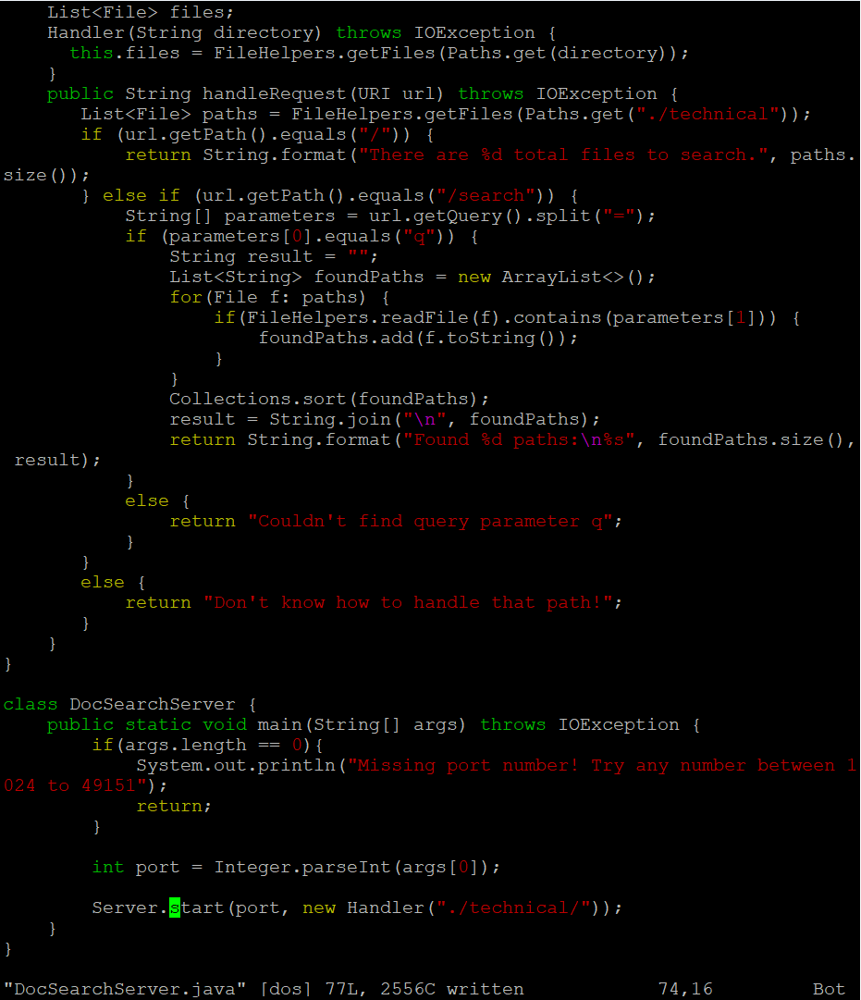

# **Week 7 Lab Report**

## **Part 1**

I chose to complete the first task: "In DocSearchServer.java, change the name of the start parameter of getFiles, and all of its uses, to instead be called base."

Vim command sequence: `:%s/start/base/gc<Enter>y<Enter>y<Enter>y<Enter>n:w<Enter>`

* `:%s/start/base/gc` will ask and change every occurrence of `start` to `base` in the file.

* `y<Enter>y<Enter>y<Enter>n` to change all necessary words.

* `:w` to save changes to the file.

## **Part 2**

I chose to perform the same changes as in Part 1.

* It took me 46 seconds to do this by ssh. And, with Visual Studio and scp, 105 seconds.

I would prefer to work directly on a remote machine because it is easier and faster than using scp, especially if several files were used.

However, for creating a larger project with many files I would choose to do it first in VS Code because I can use multiple GUI applications, like a browser, at once.

[Back](index.html)
