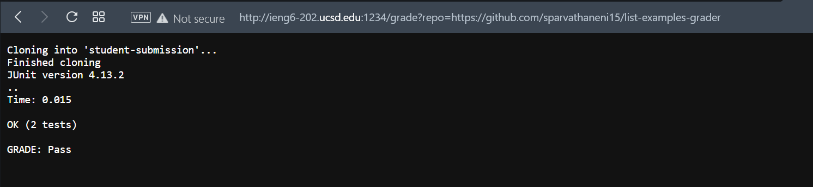
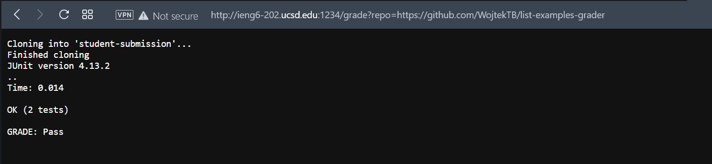
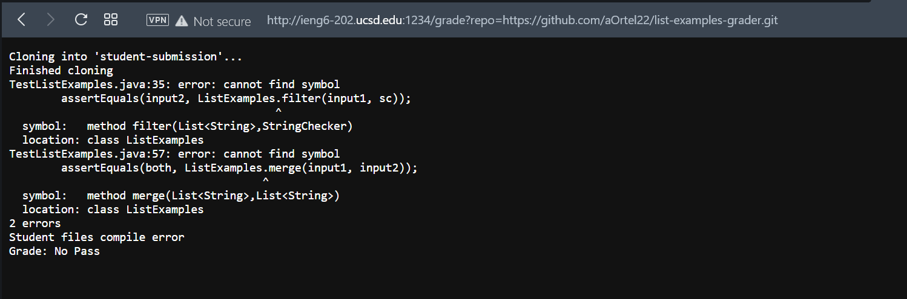

# **Week 9 Lab Report**

## **grade.sh**

```
CPATH=".:lib/hamcrest-core-1.3.jar:lib/junit-4.13.2.jar"

rm -rf student-submission
git clone $1 student-submission
echo 'Finished cloning'

cp student-submission/ListExamples.java ./

if [[ ! $? -eq 0 ]]
then
	echo "Student Submission does not contain required file"
	echo "GRADE: No Pass"
	exit 1
fi


javac -cp $CPATH *.java
if [[ ! $? -eq 0 ]]
then
	echo "Student files compile error"
	echo "Grade: No Pass"
	exit 2
fi

java -cp $CPATH org.junit.runner.JUnitCore TestListExamples

if [[ ! $? -eq 0 ]]
then
	echo "See test feedback"
	echo "GRADE: No Pass"
	exit 3
else
	echo "GRADE: Pass"
fi
```

1) https://github.com/sparvathaneni15/list-examples-grader



2) https://github.com/WojtekTB/list-examples-grader



3) https://github.com/aOrtel22/list-examples-grader.git



## **Part 2**

I chose to analyze this submission: https://github.com/aOrtel22/list-examples-grader.git

```
rm -rf student-submission
git clone $1 student-submission
echo 'Finished cloning'
```

`rm -rf` removes the existing directory with the previous submission if it is the directory.

`git clone $1` clones the submitted directory as student-submission.

```
cp student-submission/ListExamples.java ./

if [[ ! $? -eq 0 ]]
then
	echo "Student Submission does not contain required file"
	echo "GRADE: No Pass"
	exit 1
fi
```

`cp` copies `ListExamples.java` to the working directory to run tests on it.

`if then` compares `cp`'s return code with 0. If the return code is not 0, `cp` produced an error, then there is no required file is student submission. Then, the script exits. Grade No Pass is assigned.

```
javac -cp $CPATH *.java
if [[ ! $? -eq 0 ]]
then
	echo "Student files compile error"
	echo "Grade: No Pass"
	exit 2
fi
```

`javac` compiles `.java` files. In `javac`'s standard output we will see what problems are with the submitted file.

`if then` compares `javac`'s return code with 0. If the return code is not 0, `javac` produced an error, then the student submission is not compiling. Then, the script exits. Grade No Pass is assigned.


[Back](index.html)
